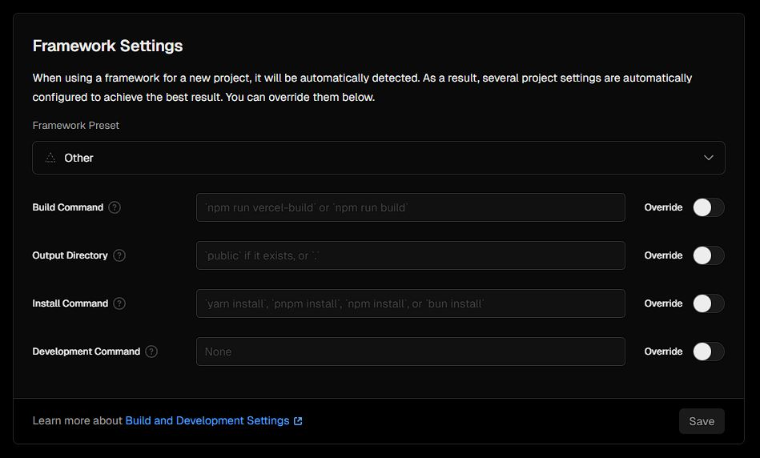
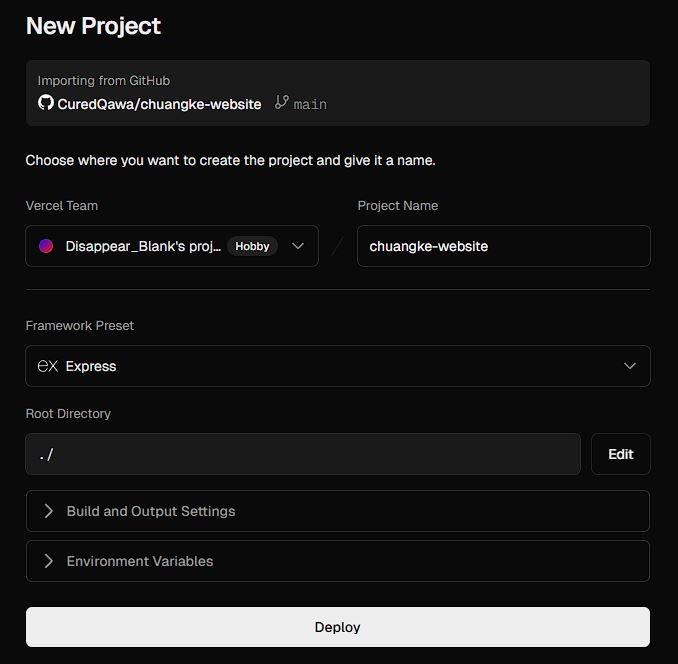

### 第一步 整理项目结构

- 这里假定你的 Express 项目结构大致如下：

```html
E:\html\pers-website\
├── index.js               # Express 入口
├── router.js              # 路由文件
├── public/                # 静态资源
│   ├── html/
│   │   └── home.html      # 首页
│   ├── css/
│   ├── js/
│   └── img/
├── node_modules/          # 依赖
└── package.json           # 已存在
```

### 第二步 确保 package.json 正确

修改 `package.json` 文件的内容 使其看起来大致如下：

```json title="package.json"
{
  "name": "pers-website",
  "version": "1.0.0",
  "main": "index.js",
  "scripts": {
    "start": "node index.js"
  },
  "engines": {
    "node": "22.x"  // 必须设置，避免 Vercel 报错
  },
  "dependencies": {
    "express": "^5.1.0"
  },
  "devDependencies": {
    "@vercel/node": "^5.3.12"
  }
}
```


### 第三步 修改 index.js 

这一步用于导出实例，供 Vercel 使用。

```js title="index.js"
const express = require('express');
const path = require('path');
const app = express();

// 引入路由
const router = require('./router');
app.use('/', router);

// 托管静态资源
app.use(express.static('public'));

// 仅在本地运行时启动服务器
if (require.main === module) {
  const port = process.env.PORT || 4000;
  app.listen(port, () => {
    console.log(`服务器运行在:${port}端口上`);
  });
}

// 必须导出 app，供 Vercel 使用
module.exports = app;
```

- 写的 `app` 导出的时候就导出成 `module.exports = app;` ，写别的就导成你写的，不过不推荐这么做，可能会识别错误

- `if (require.main === module)` 也是要改的，注意别漏了。

### 第四步 创建 api/index.js (Vercel 入口)

创建文件夹 `api/`，并添加 `api/index.js`：

```js title="api/index.js"
// api/index.js
const app = require('../index');

// Vercel Serverless Function 入口
module.exports = (req, res) => {
  app(req, res);
};
```
### 第五步 创建 vercel.json (核心配置)

在项目根目录创建 `vercel.json`：

```json title="vercel.json"
{
  "routes": [
    // 1. API 请求交给 Serverless Function
    { "src": "^/api/(.*)$", "dest": "/api/index.js" },

    // 2. 静态资源：/html/* /css/* /js/* /img/*
    { "src": "^/(html|css|js|img)/(.+)$", "dest": "/public/$1/$2" },

    // 3. 根路径：308 永久重定向到 /html/home.html
    { "src": "^/$", "dest": "/html/home.html", "status": 308 }
  ]
}
```

:::note[不要在JSON里面写注释]
json 不支持注释，尤其是需要读写的，会导致识别错误。记得删掉注释再部署，或者备份一个留有注释的json文件。
:::

### 第六步 托管到 GitHub

(假设你已经会把项目托管到 GitHub 了)

### 第七步 部署成Vercel项目

(假设你已经登录Vercel)

直接选中仓库 Deploy 即可。项目结构选 Others ，甚至不需要填构建命令。



- 当然，也可以直接选 Express 。好像两个都行？我当时部署使用的是 Others (没给我检测出Express)



不出意外的话 Deploy 完成后，网站就可以预览了。之后你可以绑定域名，更新内容的话只需要修改代码然后 push 到 GitHub 即可。Vercel 检测到代码变动会自动重新部署，这个过程可能要几分钟。

其实我做 Express 部署比这个 Fuwari 博客网站要早。只不过知识点是现在才整理出来发文章。