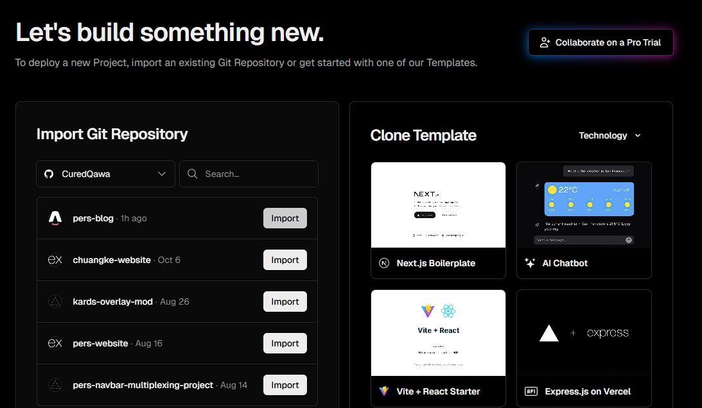
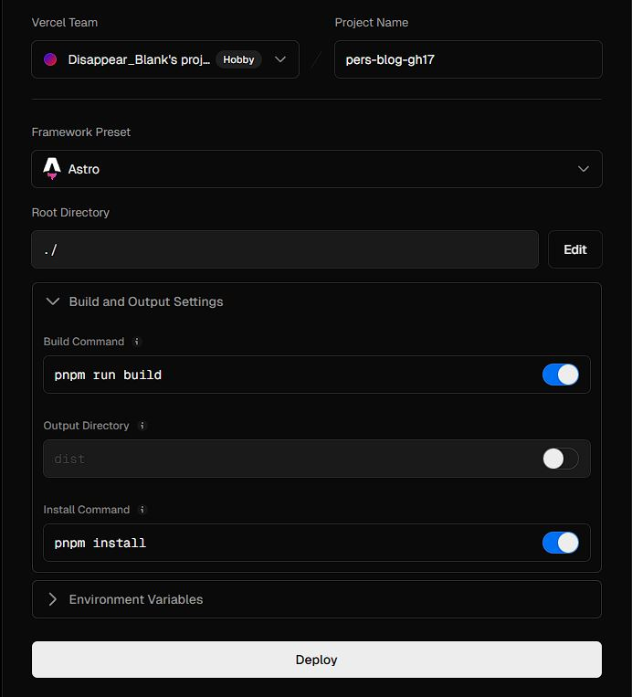
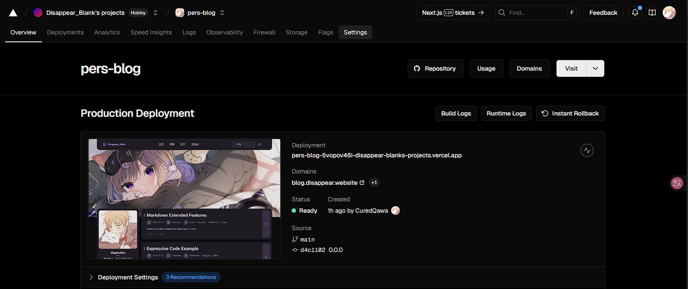

### 第一步 克隆仓库

( 这里假定你已经安装了Node.js )

准备你的工作区：

```powershell
npx degit saicaca/fuwari pers-blog
```

这会把仓库内容克隆到当前目录下的 `pers-blog` 文件夹中。

紧接着，由于这个项目强制要求使用 `pnpm` ，所以你首先要在全局安装 `pnpm` 。在 `PowerShell` 中执行:

```powershell
npm install -g pnpm
```

然后在 VScode 中打开 `pers-blog` 目录。点击顶部菜单：Terminal > New Terminal 来打开一个新终端并开始使用 `pnpm` 安装依赖：

```bash
pnpm install
```

依赖安装完成后，网页就已经可以运行来预览了：

```bash
pnpm dev
```

终端应该会提示以下信息：

```bash
PS E:\html\pers-blog> pnpm dev

> fuwari@0.0.1 dev E:\html\pers-blog
> astro dev

23:17:25 [types] Generated 2ms
23:17:26 [content] Syncing content
23:17:26 [content] Synced content

 astro  v5.13.10 ready in 10800 ms

┃ Local    http://localhost:4321/
┃ Network  use --host to expose
```

然后在浏览器中访问 http://localhost:4321/ 就可以实时预览你的网站了。后续修改并保存后，网页会自动刷新内容。

### 第二步 修改配置和内容

修改 `src/config.ts` 文件的内容以打造你的个性化网站。

网站里所有的文章都使用Markdown语言。如果你想添加文章，就在 `src/content/posts` 目录下按照格式添加.md文件。

顺带一提，如果想修改 `关于` 页面，也只需要修改 `src/content/spec/about.md` 文件就可以了

### 第三步 将代码推送到GitHub

这里假定你会用git来管理你的代码

### 第四步 在Vercel中导入仓库并部署

Vercel完全免费，是一个不错的web项目部署平台。部署流程大同小异：

> - 使用GitHub账户来登录Vercel
> - 点击 New Project
> - 然后在项目列表中找到你刚推送的仓库（如 pers-blog）
> - 点击 Import



具体的Vercel部署配置如下：

| 配置项  | 值 |
| :-------------: | :-------------: |
| Framework Preset  | `Astro` |
| Build Command  | `pnpm run build` |
| Output Directory  | `dist` |
| Install Command  | `pnpm install` |

其中Framework Preset一般会由Vercel正确识别，只需要确保值对即可：



点击Deploy即可部署项目。部署完成后，预览页面应该正常显示：



这样项目就成功上线了。接下来可以进行绑定域名之类的操作。

:::note
想要添加文章，只需要在本地写好之后再push到GitHub上即可。Vercel会识别到仓库更新并重新部署一次。
:::