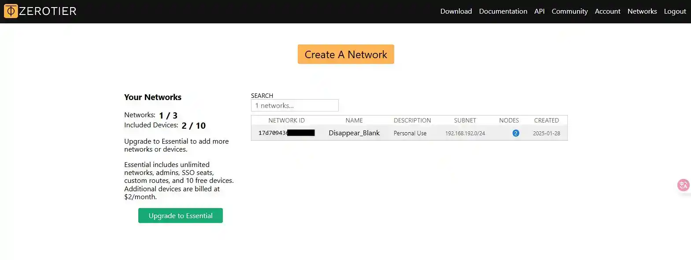
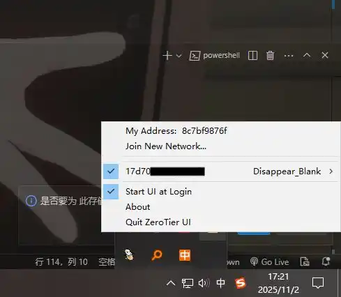
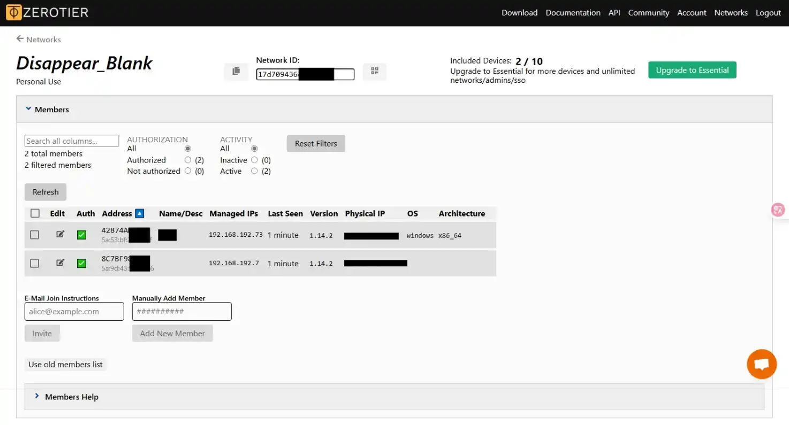
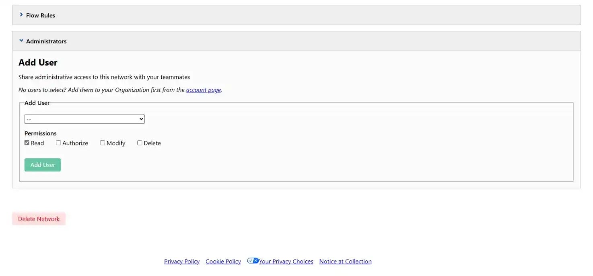

# ZeroTier 下载与安装教程


ZeroTier 是一个开源的虚拟局域网（VLAN）工具，可以让你在不同网络中的设备之间建立安全的点对点连接。本文将指导你如何在 Windows、macOS 和 Linux 系统上下载并安装 ZeroTier。


## 一、准备工作


在开始之前，请确保你的设备满足以下条件：
- 能够访问互联网
- 拥有管理员（或 root）权限（用于安装软件）


## 二、下载 ZeroTier


### 1. Windows/macOS 系统


1. 打开浏览器，访问 [ZeroTier 官方下载页面](https://www.zerotier.com/download/)。


2. 点击 **Windows** 或 **macOS** 下的下载按钮，下载 `.msi` 安装包。


### 2. Linux 系统


ZeroTier 提供了适用于多种 Linux 发行版的一键安装脚本。打开终端，执行以下命令：

```bash
curl -s https://install.zerotier.com | sudo bash
```


> **注意**：该脚本会自动检测你的 Linux 发行版（如 Ubuntu、Debian、CentOS、Fedora 等）并安装对应的 ZeroTier 包。


## 三、安装 ZeroTier


### Windows 安装步骤


1. 双击下载好的 `.msi` 文件。
2. 按照安装向导提示，点击“下一步”直至完成安装。
3. 安装完成后，ZeroTier 会自动在系统托盘中运行。


### macOS 安装步骤


1. 双击下载的 `.pkg` 文件。
2. 按照安装向导操作，输入管理员密码授权安装。
3. 安装完成后，ZeroTier 会在菜单栏中显示图标。


### Linux 安装说明


使用上述一键脚本安装后，ZeroTier 服务会自动启动。你可以通过以下命令检查状态：

```bash
sudo systemctl status zerotier-one
```


如果服务未运行，可手动启动：

```bash
sudo systemctl start zerotier-one
```


## 四、验证安装


安装完成后，获取你的 ZeroTier 节点 ID：


- **Windows/macOS**：点击系统托盘或菜单栏中的 ZeroTier 图标，即可看到 **Node ID**。
- **Linux**：在终端中运行以下命令：

```bash
sudo zerotier-cli info
```


输出示例：
```
200 info 1a2b3c4d5e6f7g8h9i0j 1.12.2 ONLINE
```
其中 `1a2b3c4d5e6f7g8h9i0j` 就是你的 Node ID。


## 五、加入网络


1. 登录 [ZeroTier Central](https://my.zerotier.com/)（需注册账号）。


- 登录完成后类似这样



2. 创建一个新网络，复制网络 ID（如 `a1b2c3d4e5f67890`）。
3. 在客户端加入网络：

- **Windows/macOS**：在 ZeroTier 界面点击 “Join New Network”，粘贴网络 ID。



- **Linux**：执行命令：

```bash
sudo zerotier-cli join a1b2c3d4e5f67890
```


4. 返回 ZeroTier Central 网页，在成员列表中勾选你刚加入的设备以授权。






## 六、常见问题


### Q：安装后无法连接网络？
A：请检查防火墙设置，确保 UDP 端口 9993 未被阻止。


### Q：Linux 下提示命令未找到？
A：请确认安装成功，并检查 `/usr/bin/zerotier-cli` 是否存在。


## 七、总结


通过本教程，你应该已经成功在你的设备上安装并运行了 ZeroTier，并能够加入虚拟网络。ZeroTier 是构建远程访问、游戏联机或私有云网络的强大工具，欢迎进一步探索其高级功能！


> 官方文档：[https://docs.zerotier.com](https://docs.zerotier.com)
